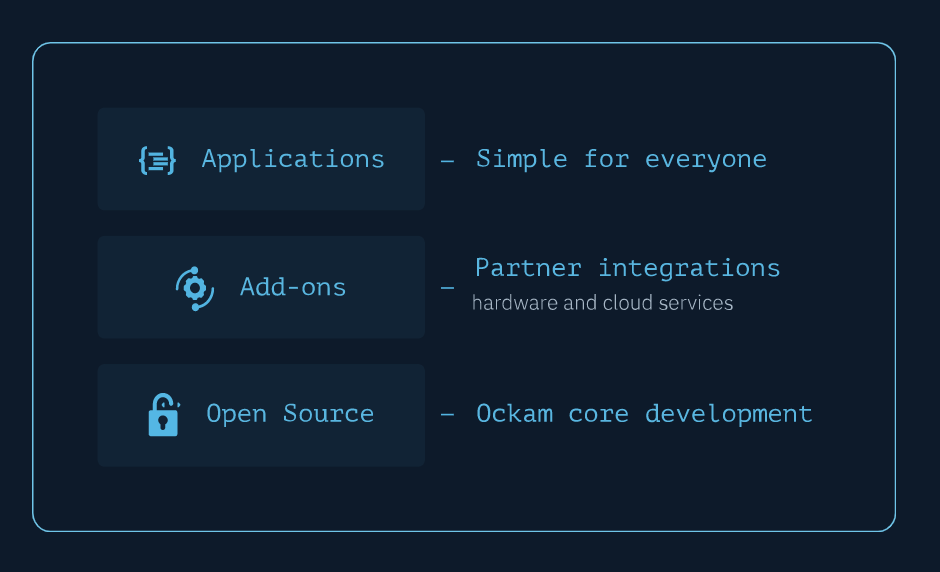

# InfluxDB Ockam Add-on



Adding security to any network transaction is hard. As the `TODO`'s pile up, and your application
logic becomes more complex, the last thing you need is to manage credentials, certificates, network
code, and cryptographic keys. Leaving your critical time-series data exposed to tampering or 
disclosure to untrusted parties isn't going to fly, though, so what do you do? 

Let us help! The Ockam InfluxDB Add-on makes it a simple to encrypt and move your data between your 
application and InfluxDB. Here's a demo of how to use `ockamd`, our deamon process you can run next
to your application and get drop-in security in minutes.

**1. Clone the Ockam repo to get the demo scripts:**
```sh
git clone https://github.com/ockam-network/ockam.git
cd ockam
```

> Make sure you're running the following commands from within the `ockam` directory. All commands 
below require that [Docker](https://docker.com) be installed on your machine. Using Ockam does _not_
require Docker, but it makes this demo easy to run and share!

**2. Run `InfluxDB` and `ockamd` as the responder end:**
```sh
./tools/docker/demo/influxdb.sh influxdb-ockamd
```

This launches `InfluxDB` and `ockamd` in a container, waiting for input from the "initiator" end, 
which you'll launch next. Think of that as your application, which creates the time-series data you
will store in `InfluxDB`. Note the "Responder public key" line written to your terminal. Make sure
to copy & paste this string into the `$COPIED_RESPONDER_PUBLIC_KEY` as the next command's argument. 
This is a basic way to verify that the initiator and responder are who they claim to be.

**3. Run `Telegraf` and `ockamd` as the initiator end:**
```sh
./tools/docker/demo/influxdb.sh telegraf-ockamd $COPIED_RESPONDER_PUBLIC_KEY
```

This launches `Telegraf` (a helpful data collection agent by InfluxData) and `ockamd` in a container
ready to capture time-series data. The "initiator" creates a 
[**secure channel**](https://www.ockam.io/learn/concepts/secure_channels) with the "responder" and 
all messages sent between them are fully encrypted, end-to-end. Note that you aren't signing or 
managing certificates, or having to set up TLS anywhere in this architechture! Learn more about 
`Telegraf` by InfluxData [here](https://www.influxdata.com/time-series-platform/telegraf/).

**4. Send `Telegraf` some input via HTTP:**
```sh
./tools/docker/demo/influxdb.sh telegraf-write
```

`Telegraf` is configured to launch `ockamd` as an 
[execd output plugin](https://github.com/influxdata/telegraf/blob/release-1.16/plugins/outputs/exec/README.md), 
which conveniently extends Telegraf to capture and process time-series data for `InfluxDB`. `ockamd` 
creates the [**secure channel**](https://www.ockam.io/learn/concepts/secure_channels), manages the 
[**transports**](https://www.ockam.io/learn/concepts/transports/), and encrypts the input from 
`Telegraf` and/or your application before it securely sends it to another `ockamd` (sitting next to 
`InfluxDB`) where it is inserted into the database after being decrypted by `ockamd`. 

_Read more about how Ockam simplifies encryption using our 
[**Vault**](https://www.ockam.io/learn/concepts/vaults/) interface abstraction._ 

> Note, use a packet capture tool such as WireShark to inspect the network traffic and see that it's
fully encrypted as `ockamd` sends and receives your time-series data over the wire.

**5. Observe the line format data written to `InfluxDB` in the responder end by running some `influxql`:**
```sh
./tools/docker/demo/influxdb.sh influxdb-query
```

Now that there's data in `InfluxDB`, run a query using this command and see it show up via the 
`influx` client. Feel free to write more data to `Telegraf` by repeating Step 4 above and re-run 
the `influxdb-query` command to see it populated. 

**6. Stop & clean-up the docker containers:**
```sh
./tools/docker/demo/influxdb.sh kill-all
```
---

Thanks for checking out Ockam's InlfluxDB Add-on! For more information, or to try using any of 
Ockam's fully open-source components (including Rust, Elixir, and C libraries), head to the 
[GitHub repo](https://github.com/ockam-network/ockam). Follow along by starring the repo, and send 
us a PR!

_Learn more about `InfluxDB` and how to use `Ockamd` with robust their time-series databases on the 
[`InfluxData` website](https://www.influxdata.com/), and our detailed 
[partner page](https://www.influxdata.com/partners/ockam/)._