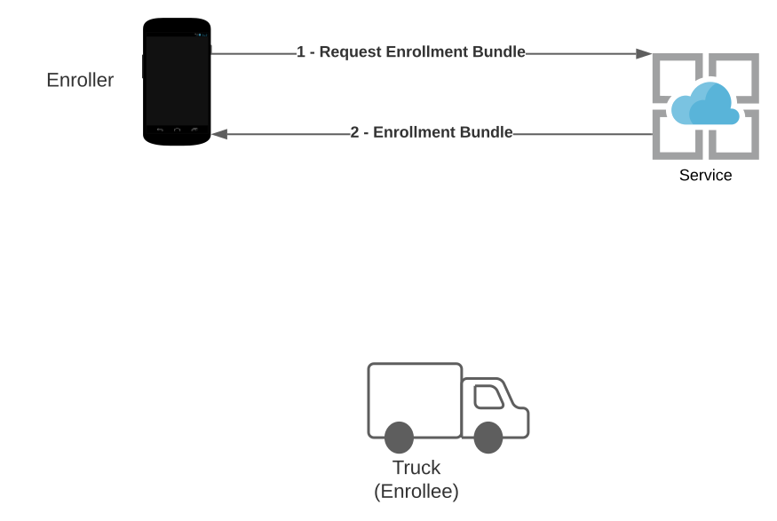
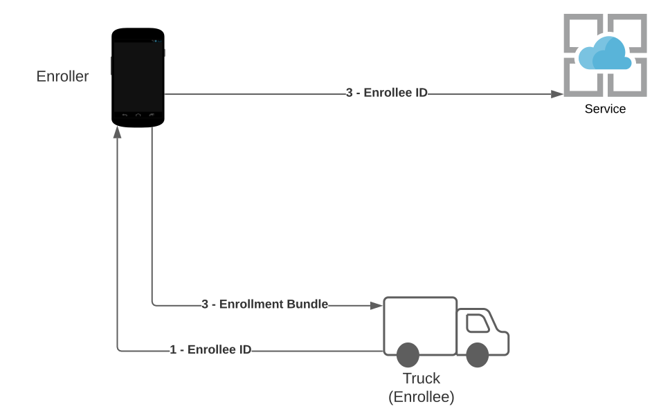
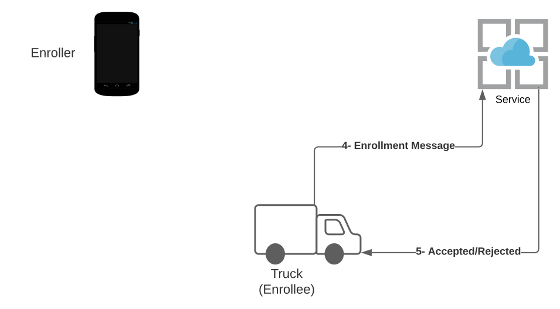

## Description

The enrollment protocol is designed to facilitate secure onboarding a device to a service where the device
doesn't know about the service and visa versa. This happens with the help of an enroller intermediary like a phone, terminal, or another device.

The three parties are the Ockam Enrollment Service (*service*) that a device wants to connect to, the *enroller* that helps onboard the device, and the device to be onboarded or enrolled called the *enrollee*.

## Background and the Problem

Enrolling IoT devices (and non IoT devices) currently happens using non-secure and/or manual processes:

1. Hardcoded credentials (username, password, api tokens)
2. Hardcoded service endpoints to obtain credentials with little to no vetting process
3. No credentials at all, device connects to another system that authenticates the connection to the service
1. Credential revocation or rotation is not implemented or easily performed

This results in the following problems

1. No security when connecting externally e.g. all data (including credentials) are sent and received in plaintext vs with encryption.
1. Usernames, passwords, api tokens are often stored without any protection on the device––an attacker can extract these values with minimal effort with remote or physical access or downloading and reverse engineering the firmware.

Ockam provides a secure enrollment protocol that solves this problem by providing a solution that is easy to use and results in a secure connection to the IoT devices to the Ockam Service.

## Protocol

### Enrollee

The enrollee can be any device or application that needs to be onboarded. Enrollees will first connect to an enroller before knowing what to do next. During this initial connection, the enrollee generates a unique identifier to send to the enroller and an optional pet name. The pet name is for human readability like "Robot Axiom" vs the unique identifier a0b1c2d3e4f5a6b7c8d9. 

### Enroller

The enroller is usually controlled by the same party as the enrollee like a connected computer terminal in a factory to a robot or a phone. In order for the enroller to faciliate onboarding to the service, it needs enrollment materials provided by the service. The enroller asks the service for an enrollment bundle that can be given to any enrollee. It may ask for more than one bundle and cache these for later. After an enrollment bundle is received, it is sent to the enrollee. The enroller also forwards the enrollee's unique identifier and optional pet name to the service. This serves two purposes. First, the service will be able recognize the enrollee when they receive a message. Second, this shows the enroller approved the enrollee to connect to the service. The service can ignore all other requests it doesn't know about. The enroller's job at this point is done and does not need to involved or communicate with either the service or the enrollee for the remainder of the onboarding process.

### Service

The service puts any enrollment identifiers received from an enroller in a pending statement with a possible expiration time. The service then waits for contact from the enrollee.

### Enrollee

The enrollee processes the enrollment bundle to create an unique encrypted enrollment message. This message is sentto the service.

### Service

The service receives the enrollment message from the enrollee and performs a series of checks to verify that:

1. The sender of the enrollment message is one that is expected
1. The enrollment message is valid
1. The cryptographic keys are valid

If the checks pass, the service and the enrollee can immediately begin communicating  in a mutually authenticated secure manner using the cryptographic keys established as part of onboarding process.

### Step 1

### Step 2

### Step 3

## Details
The specific cryptographic details can be found [here](https://github.com/ockam-network/proposals/tree/ml/enrollment-key-agreement/design/0006-enrollment).
